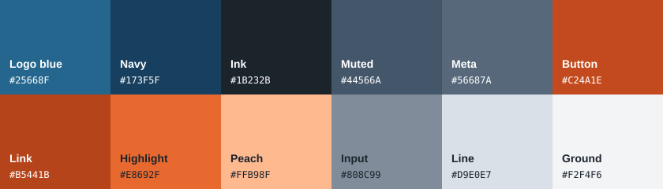
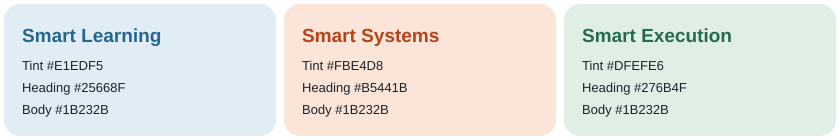
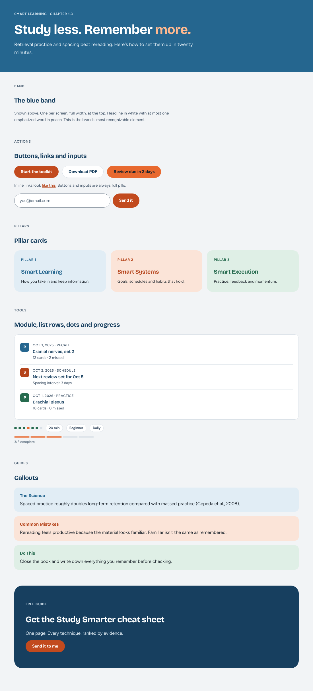

# Rapid Mastery Brand Kit

The single source for how Rapid Mastery looks: colors, type, shape, logos and components. The website, Claude Design, Artifacts and future React apps all read from here.





## Start here

| If you are… | Read |
|---|---|
| An AI tool (Claude Design, Claude Code, Artifacts) | [`AGENTS.md`](AGENTS.md) |
| A person designing something | [`guidelines.md`](guidelines.md) |
| Wiring up a site or app | **Use the tokens** below |

## What's in here

```
tokens/              Source of truth (DTCG JSON). Edit these, then npm run build.
  base/              Raw palette, type, spacing, radii
  semantic/          Roles: bg.ground, text.muted, pillar.learning.tint …
  modes/print.json   Overrides for print (white ground, small radii, no shadows)
dist/                Generated. Never edit by hand.
  css/tokens.css     CSS variables (--rm-…)
  css/tokens-print.css
  js/tokens.js       ES module exports (+ tokens.d.ts)
  json/              Nested and flat JSON
  tailwind/preset.cjs
components/
  components.css     Class-based components built only from tokens
  react/index.jsx    React wrappers over the same classes
  html/index.html    Live specimens of every component
fonts/               Bricolage Grotesque + Figtree (OFL), fonts.css
logos/               svg/, png/ (plain git), source/ (Git LFS)
assets/              README images
```



## Use the tokens

**Plain HTML (rapidmastery.com):** copy `dist/css/tokens.css` and `components/components.css` into the site, or add this repo as a git submodule. Then replace hard-coded hex values with variables:

```css
body { background: var(--rm-color-bg-ground); color: var(--rm-color-text-primary); }
.btn { background: var(--rm-color-action-primary-bg); border-radius: var(--rm-radius-pill); }
```

**React / Vite:**

```bash
npm i github:pitredish/rapidmastery-brandkit
```

```js
import '@rapidmastery/brand-kit/fonts.css';
import '@rapidmastery/brand-kit/css';
import '@rapidmastery/brand-kit/css/components';
import { Band, Button, PillarCard } from '@rapidmastery/brand-kit/react';
import { ColorBgBrand } from '@rapidmastery/brand-kit';
```

**Tailwind:** `presets: [require('@rapidmastery/brand-kit/tailwind')]` gives classes like `bg-rm-bg-brand` and `text-rm-text-muted` that point at the CSS variables.

## Change a color

1. Edit the value in `tokens/base/color.json` (or the role in `tokens/semantic/`).
2. `npm install` once, then `npm run build`.
3. Add a line to [`CHANGELOG.md`](CHANGELOG.md), commit `tokens/` and `dist/` together, and tag the version (`git tag v1.0.1`).
4. Renaming or removing a token is a breaking change: bump the major version.

## Git LFS

Source files (`.ai`, `.psd`, `.fig`, video, `logos/source/`) go through LFS. Run `git lfs install` once on each machine. SVG, PNG, fonts and tokens are deliberately **not** in LFS, because GitHub Pages and raw links serve LFS files as pointer text.

## Open items

- Logo files not added yet, and the wordmark font's license is unverified. See [`logos/README.md`](logos/README.md).
- rapidmastery.com still uses the 09/02 cream palette with literal hex values. Migrating it to these tokens is the next step.
